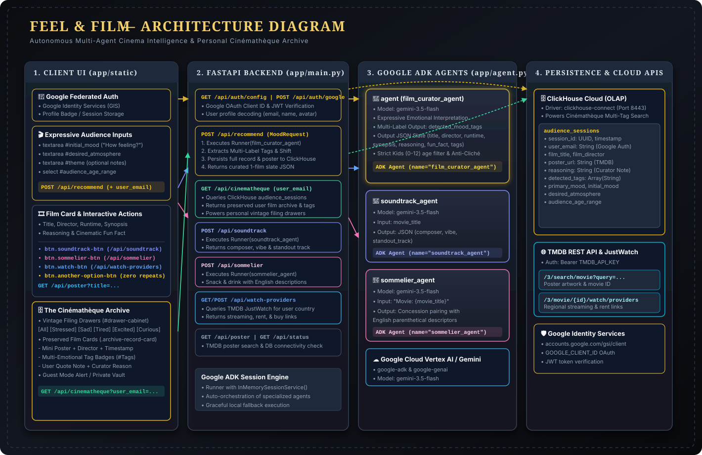

# Architecture & System Design — Feel & Film

## Overview
**Feel & Film** is an autonomous multi-agent cinematic recommendation and concession platform built with **FastAPI**, **Google ADK** (powered by **Gemini 3.5 Flash**), and **ClickHouse Cloud**.

---

## 1:1 System Component Mapping

### 1. Presentation Layer (`app/static/`)
- **`index.html` & `app.js`**:
  - **Audience Configuration Form**: Inputs for `initial_mood`, `desired_atmosphere`, `audience_age_range`, and optional `theme` keyword.
  - **Dynamic Film Slate (`#slate-container`)**: Renders the recommended film's title, director, runtime, synopsis, mood tags, reasoning, and fun fact.
  - **Poster Loader**: Asynchronously fetches and displays the TMDB poster art via `GET /api/poster`.
  - **Interactive Triggers**:
    - **`soundtrack-btn`**: Calls `POST /api/soundtrack` to load composer, vibe, and standout track.
    - **`sommelier-btn`**: Calls `POST /api/sommelier` to load custom snack and drink pairings.
    - **`watch-btn`**: Calls `GET /api/watch-providers` to load location-based streaming & rental platforms.
    - **`another-option-btn`**: Appends the current title to `excluded_films` and requests a new recommendation.
  - **Audience Metrics Chart (`#moodChart`)**: Real-time **Chart.js** bar chart populated from `GET /api/stats`.

### 2. Backend Gateway (`app/main.py`)
- **`POST /api/recommend`**:
  - Persists session event to ClickHouse `audience_sessions` (`session_id, initial_mood, desired_atmosphere, audience_age_range`).
  - Runs `film_curator_agent` via Google ADK `Runner` with `InMemorySessionService` (or fallback).
  - Returns structured 1-film slate JSON.
- **`POST /api/soundtrack`**:
  - Runs `soundtrack_agent` via `Runner` with the target `movie_title`.
  - Returns composer, musical atmosphere vibe, and standout track.
- **`POST /api/sommelier`**:
  - Runs `sommelier_agent` via `Runner` with the target `movie_title`.
  - Returns plain-text snack & drink pairing recommendation.
- **`GET /api/watch-providers`**:
  - Queries TMDB Watch Providers API (`/3/movie/{id}/watch/providers`) based on the user's detected country region.
  - Returns available streaming subscriptions, rentals, purchases, and direct JustWatch/TMDB watch links.
- **`GET /api/poster`**:
  - Calls `fetch_poster_url_internal()` which searches TMDB API (`/3/search/movie`) with `TMDB_API_KEY`.
- **`GET /api/stats`**:
  - Executes aggregation query in ClickHouse on `audience_sessions` filtered by valid canonical moods.
- **`GET /api/status`**:
  - Verifies ClickHouse configuration status.

### 3. Google ADK Multi-Agent Trio (`app/agent.py`)
- **`agent` (`film_curator_agent`)**:
  - Framework: `google.adk.agents.Agent`
  - Model: `gemini-3.5-flash`
  - Function: Evaluates user mood, atmosphere, theme, and enforces strict age constraints (e.g. G/PG for `Kids (0-12)`).
- **`soundtrack_agent`**:
  - Framework: `google.adk.agents.Agent`
  - Model: `gemini-3.5-flash`
  - Function: Analyzes film musicology and returns structured OST details.
- **`sommelier_agent`**:
  - Framework: `google.adk.agents.Agent`
  - Model: `gemini-3.5-flash`
  - Function: Recommends curated snack & drink concession pairings.

### 4. Persistence & External APIs
- **ClickHouse Cloud**:
  - **`audience_sessions`**: Stores session ID, timestamp, initial mood, desired atmosphere, and audience age group.
  - **`film_catalog`**: Pre-seeded film database schema with metadata and mood tags.
- **The Movie Database (TMDB) API**:
  - REST API endpoint `/3/search/movie` utilized for poster images and metadata verification.
- **Google Cloud Gemini**:
  - `gemini-3.5-flash` model powering the ADK agents.
